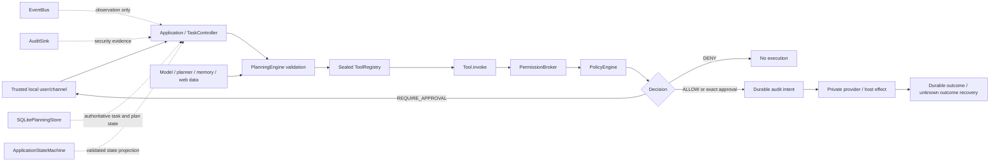

# JARVIS v1 Security Constitution

Status: **authoritative security policy**. This document describes the minimum
boundary that every production composition, integration, update, and future
autonomous workflow must preserve. Generated knowledge may index this document,
but must not rewrite it. Historical ADRs explain earlier choices; where an older
document conflicts with this constitution, this constitution governs v1.

## Purpose and non-goal

The Trusted Core is the small body of application-owned code that decides whether
an action may happen. Model output, plans, tools, events, memories, discovered
content, generated patches, worker agents, and scheduler records are data crossing
that boundary. They do not become authority because they are typed, persisted, or
produced by another JARVIS component.

This is an application security boundary against normal model/planner/tool and
self-improvement paths. Python process isolation is not provided by language-level
privacy. Code already executing in the trusted process can inspect objects,
monkeypatch methods, instantiate adapters, and call the operating system. Therefore
unreviewed integrations are not loaded in the production process. A future hostile
plugin boundary requires a lower-privilege process plus typed broker-owned IPC.

When sandbox integrations need host access, the trusted-side `HostProxy` is the
only supported bridge. It validates exact package/integration identity, manifest
capability/action, operation scope, and the normal broker receipt. Its network,
filesystem, credential, process, and device contracts are narrow and deny by
default; a sandbox cannot submit an approval or permission claim. Raw Vault
secrets never cross the bridge. See [`sandbox-host-proxies.md`](sandbox-host-proxies.md).

## Authoritative runtime boundary

`SQLitePlanningStore` owns durable task and plan state. `ApplicationStateMachine`
owns the validated transition protocol and an inspectable rebuildable projection.
`PermissionBroker` owns runtime authorization. `AuditSink` owns durable security
evidence. `EventBus` owns bounded coordination and diagnostics. None substitutes
for another: an event is not an authorization receipt, an audit record is not
permission, and a state transition cannot authorize a tool.

## Immutable invariants

These rules may become stricter during recovery. Routine configuration, generated
code, integrations, workers, model output, and self-improvement must not weaken
them.

1. Every planner-selectable privileged operation passes through `Tool.invoke` and
   the runtime-owned `PermissionBroker` before reaching its provider.
2. Model output, model-authored configuration, prompts, memories, events, tool
   output, and discovered content are never authorization.
3. A tool cannot register, approve, or authorize itself. Registration binds an
   exact tool instance to its manifest permissions before the registry is sealed.
4. A planner, worker, scheduled job, or delegated subtask cannot broaden the
   permissions, scope, principal, or budget it received.
5. Approval is bound to request ID, task, requesting principal, exact action,
   argument fingerprint, permission, normalized scope, tool, policy, expiry, and
   consumption state. The submitted choice, approver, source, and remembered
   duration travel in an instance-bound, expiring, single-use trusted-channel
   context. Unknown decision values fail closed. Limited grants remain exact and
   time-bounded; there is no global always-allow grant.
6. System-managed credentials and secret-store values are never injected into
   model prompts and do not enter generic events, validation logs, ordinary audit
   records, generated knowledge, or durable ordinary memory. User-entered text may
   itself contain a secret; it is sent only to the configured literal-loopback
   model provider, and heuristic content detection is defense in depth rather than
   a complete data-loss-prevention guarantee.
7. Privileged execution requires a successful pre-effect audit intent. Generated
   integration code receives neither the audit handle nor a way to disable audit.
8. Safe mode is selected by trusted startup validation or persistence failure.
   UI, model, integration, and recovery code may not transition it to ready.
9. Routine self-improvement cannot propose a Trusted Core change through its
   trusted workspace write port, and Phase 11 exposes no merge/deploy operation.
10. A future scheduler/background job confers no authority. At firing time it must
    submit through `TaskController` and current policy under the original principal.
11. Integration code has no ambient authority. Generated integration code is never
    imported into Trusted Core and may cross only the `SandboxProcess` typed IPC
    boundary. The current Windows Job Object boundary owns processes and resources
    but is not a complete filesystem/network/AppContainer sandbox; unreviewed code
    is not certified merely because it is out of process.
12. An interrupted externally visible or irreversible operation with unknown
    outcome is recoverable evidence, never an instruction to replay blindly.
13. Remote approval is disabled in v1. A future implementation must authenticate
    its channel and human principal before constructing a broker decision; model or
    tool claims are rejected.
14. Ordinary `USER_CONFIG`, environment values, and generated configuration may
    disable capabilities but cannot enable unsupported authority, change the
    compiled security-policy version, or weaken a policy rule.
15. Recovery may disable tools, revoke approvals, quarantine workspaces, or enter
    safe mode. It cannot silently loosen scopes, create an approval, skip audit, or
    reinterpret an unknown outcome as success.

## Trusted Core module manifest

The compiled classifier in `jarvis.security.integrity` is the enforcement source of
truth. The important Trusted Core regions are:

- `jarvis/security/**`: integrity classification, mutation policy, and startup
  validation;
- `jarvis/permissions/**`: policy, broker, approval lifecycle, receipts, and audit;
- `jarvis/tools/{__init__,base,models,registry}.py`: manifest and invocation boundary;
- `jarvis/{runtime,bootstrap,api,task_controller}.py` and
  `jarvis/core/{config,health}.py`: canonical composition, readiness, and
  capability requests;
- `jarvis/recovery.py`: snapshot, restore-point, startup-marker, and Safe Mode
  gates;
- `jarvis/sandbox.py`: generated-integration process ownership, bounded typed IPC,
  and native Windows Job Object lifecycle;
- `jarvis/improvement/**`: isolated mutation, supply-chain, gate, evaluation, and
  proposal integrity boundaries;
- `.github/workflows/**`, `scripts/quality.py`, `pyproject.toml`, dependency
  manifests/locks: release and self-certification controls;
- `tests/trusted_core/**`: dedicated constitutional regression tests.

The list is deliberately conservative. State/planning/memory/events and current
computer, camera, vision, voice, application, and AI provider modules are
`PRODUCTION_CORE`. They are reviewable production code but do not decide how the
Trusted Core itself may be replaced. Moving a module out of `TRUSTED_CORE` is an
owner security release, not a routine refactor.

## Integrity classes

| Class | Meaning | Routine autonomous mutation |
|---|---|---|
| `TRUSTED_CORE` | Authorization, audit, startup, mutation and release controls | Never |
| `PRODUCTION_CORE` | Current reviewed executable application code | Isolated proposal only; production apply requires controlled update, full gates, and independent authority |
| `INTEGRATION` | Future OS-confined integration artifacts behind typed IPC | Allowed only in an isolated proposal/test flow; none of the current in-process Python providers qualify |
| `GENERATED` | Non-importable generated indexes/artifacts | Allowed within its owning workflow; executable/startup artifacts are rejected |
| `USER_CONFIG` | Operator preferences and requested capability settings | Never by routine improvement; schema validation may only preserve or reduce authority |
| `DATA` | Service-owned databases, logs, caches, models, screenshots and temporary artifacts | Not a source mutation target; only the owning service writes it |

Paths are repository-relative, forward-slash normalized, and unambiguous. Absolute,
unknown, traversal, duplicate-separator, backslash, ADS, reserved Windows-name,
UNC, device, and executable-generated forms fail closed. Filesystem providers also
reject UNC/device/extended and alternate-stream authorization paths. Reparse checks
are repeated at the workspace write boundary; see residual TOCTOU risk below.
The generated/integration allowlist accepts only inert text/data suffixes; every
consumer of JSON/YAML still must apply a strict data-only schema and must never turn
those documents into imports, entry points, commands, or configuration authority.

## Mutation policy

Mutation classification is independent of candidate risk, model confidence, tests,
or an approval statement inside a prompt.

Self-modification also has a separate trusted level classification. The complete
path set of a proposed patch is classified by the application-owned
`ModificationTrustClassifier`; no model or worker may declare a lower level, and
the highest level in a mixed patch controls the gate set. The canonical level
contract, including rename and patch-splitting rules, is in
[`self-modification-policy.md`](self-modification-policy.md).

Level 1 is Generated Integration, Level 2 is User-space JARVIS, Level 3 is the
Core Agent Runtime, Level 4 is PermissionBroker/Vault/security services, and
Level 5 is Updater/Recovery/Security Constitution/root of trust. Level 4 and
Level 5 are not agent-editable. The classifier, mutation policy, and security
constitution are Level 5 surfaces and cannot be changed by the routine
improvement path to relax a later gate.

| Workflow | Isolated proposal | Production apply |
|---|---|---|
| Routine improvement | May inspect/test `PRODUCTION_CORE`, `INTEGRATION`, and non-executable `GENERATED`; cannot touch `TRUSTED_CORE`, config, data, or unknown paths | Never; no production deploy port exists |
| Controlled update | Same proposal containment | `PRODUCTION_CORE` only after complete trusted gates and an opaque authority owned by the update composition |
| Owner security release | Separate review workspace/path | Sole path for `TRUSTED_CORE`; full gates and a separately held opaque owner authority are mandatory |

The Phase 11 `TrustedWorkspaceChangeApplier` supplies its own fixed routine,
isolated context. Coding-agent output cannot choose the authority, stage, classifier,
or production path. Future controlled/owner release records are one-time, expiring,
and bind the task, path, base and candidate revisions, diff digest, and gate-report
digest. The authorizer is only a trusted-composition capability; v1 has no external
owner-authenticated release service and no production write/deployment executor. A
policy decision or record alone is not a write capability.

## Startup security validation

`StartupSecurityValidator` runs before directory creation, logging, provider
construction, migrations, or database access. A machine-readable violation report
causes `ApplicationRuntime` to start with no container in `SAFE_MODE`.

The v1 validator checks:

- exact supported security-policy version and mandatory structural Trusted Core
  mapping (this detects drift, not malicious modification of the validator itself);
- literal loopback HTTP Ollama endpoint with no user info, query, fragment, or proxy
  environment use (`httpx` clients use `trust_env=False`);
- an absolute, non-root, directory-valued application-data path with lexical
  reparse checks and no source/`.git` overlap; the `.jarvis` default is anchored to
  the trusted project root rather than the process working directory;
- fixed runtime child directories and database paths are revalidated for canonical
  containment, symlinks/junctions, type, and database hard links before creation
  and immediately around store opening;
- rejection of unsupported production activation for computer control, camera,
  application/package management, conversational voice, multi-agent execution,
  improvement, remote approval, and autonomous scheduling.

STT/TTS provider settings alone do not activate hardware in the canonical runtime.
The legacy assistant composition refuses to create microphone/TTS paths from those
settings and its AI factory enforces the same literal-loopback endpoint policy.
Hardware activation remains unavailable until it is brokered and wired by the
canonical runtime.

A custom absolute application-data directory is trusted operator configuration,
not a model-selectable path. V1 validates its shape and fixed children but does not
authenticate directory ownership or prove it is dedicated. Operators should use
the anchored default or a dedicated empty/local directory; ACL ownership and a
final-handle marker are required before accepting such paths from any less-trusted
configuration channel.

After trusted composition, the production tool registry and broker registration
table are sealed. Runtime/container references are read-only through normal Python
assignment. This prevents accidental or normal integration replacement; it is not
a substitute for process isolation against already-executing hostile Python.
The HTTP health surface starts this same runtime and returns a non-ready response
for safe mode, runtime error, or malformed environment settings; it cannot mark
itself healthy independently of Trusted Core startup.

## Authorization, approval, and audit rules

- `PolicyEngine` recognizes only granular `Permission` enum values and exact
  trusted actions. Missing, disabled, unknown, malformed, or out-of-scope policy
  denies.
- Policy and action records validate enum types and bounded safe summaries. Approval
  display and scope text rejects control, ANSI, non-printing, and bidi-formatting
  characters. A raw string that resembles a decision is not a decision.
- The broker overwrites tool/task scope from trusted invocation context and binds
  the exact registered object and declared permission set.
- An approved request is matched to the requesting user as well as task, tool,
  action, keyed argument fingerprint, trusted action/resource fingerprint,
  permission, scope, and expiry. The action fingerprint binds the safe display
  summary, risk, and safety class; a changed package/source/version or other trusted
  indirection therefore requires a fresh approval. A second user cannot consume it.
- `PermissionBroker.decide` accepts only a signed, expiring, single-use
  `TrustedApprovalContext` from its paired verifier. A caller-constructed identity,
  source, request ID, choice, or remembered duration is not approval. The minting
  authenticator is a trusted-channel capability and is never passed to a planner,
  tool, worker, event consumer, or integration.
- A broker receipt is registered internally, expires at or before every approval
  and scoped-duration bound, and is claimed exactly once immediately before the
  host effect. Outcome recording consumes the exact active receipt only after the
  durable append succeeds; forged, expired, or replayed receipt evidence is
  rejected. An unresolved exact task/tool/action/fingerprint blocks another
  authorization in the same process.
- Before returning a usable receipt, the broker appends `authorized_intent` to the
  audit sink. Audit failure denies execution. Approval audit records retain the
  request ID and requesting principal. The post-effect result is a separate append;
  if it cannot be made durable, the tool reports `UNKNOWN_OUTCOME` and the canonical
  planner persists `RECOVERING` without retry or replan.
- `PermissionRequested`/`Granted`/`Denied` events are redacted observations. They
  do not alter broker state and cannot be presented as approval receipts.

### Trusted permission presentation

Permission narration is a trusted application concern, not a model capability.
`TrustedActionNarrator` accepts only a broker-created `ApprovalRequest`, or a
typed `PermissionRequest` paired with the exact trusted `ActionDescriptor` that
declared it. It deterministically creates one immutable
`TrustedPermissionPresentation` containing the short explanation, exact action
details, target, normalized scope, effect, risk, and requested permission.
There is no parameter for model-provided wording, a policy decision, an owner
identity, or an approval claim.

`ExactOperationRenderer` renders that same immutable presentation object. Desktop
and voice surfaces must consume the object rather than independently describing
the operation. `VoiceApprovalChoice.YES`, `NO`, and `DETAILS` are fixed display
labels only: they do not mint or carry approval, and a future voice ingress must
accept only an authenticated trusted-channel context. Conditional, ambiguous,
or model-generated speech is never a trusted approval decision.

The current runtime has no approval authenticator and therefore remains
deny-all. The presentation contract does not change that state and cannot be
used to bypass `PermissionBroker`.

### Trusted Core protected boundaries

The following remain inside the trusted security boundary: trusted identity and
approval authentication, `PermissionBroker`, root policy, the `CredentialVault`
boundary, audit integrity, sandbox/update/recovery gates, and mutation
authorization. `CredentialVault` is the sole secret authority. It stores only
credential metadata in its app-owned database and delegates secret bytes to an
explicit secure backend; unsupported hosts fail closed. Credential-like data is
still rejected from ordinary stores, and generic authentication providers do
not receive trusted policy or authority.

Generated or unreviewed code is data and may be stored only as inert, bounded
artifacts. It is not imported, dynamically loaded, or executed inside the trusted
JARVIS process. A discovery result, generated index, model response, or event
cannot disable any of these mechanisms.

`MutationAuthorization` binds the owner identity and authenticated source to the
exact authority, task, canonical path, base revision, candidate revision,
diff fingerprint, gate-report fingerprint, issue time, and expiry. Its
single-use HMAC record is consumed only when the matching trusted mutation
context passes the required gates. Malformed metadata, changed identity/source,
path, revision, candidate, diff, gate, or expiry fails closed.

Remote approval remains forbidden. The canonical runtime has no context-minting
capability and configures its broker with a deny-all verifier. The tested authenticator
primitive proves only that a decision came through its paired local ingress; it does
not authenticate an operating-system user. A future trusted UI service must authenticate
the human before minting a context, and neither the authenticator nor its contexts may
be exposed as a generic model/tool/network endpoint.

## Threat model

| Threat | v1 control | Residual / required next control |
|---|---|---|
| Prompt injection or malicious web/model output | Strict schemas, advisory discovery/memory, no authority from text, external evidence isolation | Semantic content filtering is not proof; keep execution behind broker |
| Forged receipt / approval replay / task substitution | Caller-supplied context receipt rejected; keyed argument and trusted-action fingerprints, requester binding, effect-time expiry, issue/active ledgers, and single consumption | Raw Python can call nominally private providers; isolate integrations and use a trusted non-rollback time source |
| Malformed approval choice / caller-claimed identity | Instance-bound HMAC context, exact choice/request/source binding, expiry, single use, enum validation, and exhaustive branches | Real UI still must authenticate its human before invoking the minting capability |
| Malicious integration / monkeypatching broker | No dynamic integration loader; current Python providers are production-reviewed; registry sealed | Same-process Python is ambient authority: build lower-privilege process/RPC sandbox |
| Generated code imports around `Tool.invoke` | Generated source is never dynamically executed; improvement cannot change Trusted Core; no deployment path | Sandbox generated tests; static scanning alone is not proof |
| Unsafe subprocess / shell injection | Explicit executable and argument arrays, no shell, exact argument catalog, timeout/cancel | Pin executable signer/hash and harden Windows DLL search for every provider |
| PATH/environment poisoning | Controlled commands require absolute existing executable and pass a minimal environment; Git uses an absolute executable, disables fsmonitor/hooks/external diff, and receives a bounded path; local model clients ignore proxy env | Winget/application launch still need universal executable identity; Git executable signer/hash and checkout-filter policy are not pinned |
| Symlink/junction/reparse/TOCTOU | Canonical containment, alias/reparse checks, fixed runtime-child and SQLite-sidecar validation, database hard-link rejection, workspace tree digest | Custom app-data remains trusted operator input; mapped/removable drive identity is not verified, and path checks cannot eliminate directory-swap races or prove every NTFS 8.3 alias; use local fixed-volume checks, ACL-owned roots, and final-handle/handle-relative Windows opens |
| UNC/extended/device/ADS path | Mutation and permission normalization reject these forms | Hardware/provider code must preserve final-handle checks |
| Event spoofing / feedback storm | Event-type/payload pairing, bounded subscriber queues, bounded correlation LRU, and per-chain loop limits; events never authorize | Source/correlation metadata is not authenticated, lifecycle delivery can precede a durable write, and fresh-ID rotation can evade a per-chain loop cap; consumers must reconcile against owners and untrusted subscribers require process isolation |
| Audit suppression | Durable pre-effect intent; sink is runtime-owned and not given to integrations | Same-process code can close/patch it; isolate integrations and monitor sink health |
| Credential leakage | Safe summaries/fingerprints, sanitized generic exception boundaries, local-only model endpoint, heuristic memory secret exclusion, no generic binary sensor events | User text and provider-specific output can contain unknown secret formats; planning inputs/outputs need a redacted artifact boundary before privileged tools are enabled |
| Memory poisoning | Provenance and untrusted-data flags; no memory as instructions/authority; explicit long-term policy | User-confirmation is currently a trusted caller assertion, not authenticated UI proof |
| Worker-agent escalation | Delegated permission intersection, no recursive spawn handle, no broker/registry in worker contract | Same-process worker implementation remains trusted code |
| Future scheduler escalation | Feature flag rejected and no scheduler exists | Submit fresh tasks under original principal; never persist receipts |
| Future self-update escalation | Trusted mutation classifier, isolated worktree, no merge/deploy port | Owner release signing/identity, protected VCS metadata, and OS sandbox still required |
| Unknown external effect | Effect-time receipt claim, durable intent/outcome evidence, duplicate unresolved-effect denial, and non-replanning `RECOVERING` state | Provider-specific reconciliation and an authenticated operator-resolution workflow are still required |

## Security verification

Dedicated tests in `tests/trusted_core/` and related permission/improvement/memory
suites cover:

- every integrity class, unknown and malformed paths, traversal, UNC/device/ADS,
  Windows reserved names, and generated executable rejection;
- routine, controlled-update, forged authority, and owner-release mutation rules;
- direct attempts to change permission, tool-boundary, improvement, and runtime
  Trusted Core files through the Phase 11 applier;
- unsafe feature flags, non-local model endpoints, pre-side-effect safe mode, and
  read-only runtime state/container references;
- sealed tool/broker registration;
- malformed approval decisions, cross-user approval substitution, audit failure
  before request/decision/effect, forged/expired/replayed/modified approval contexts,
  effect-time expiry, durable intent/outcome ordering, outcome-audit failure,
  clock-forward/rollback replay, changed trusted action semantics, unresolved-effect
  duplicate denial, and receipt outcome replay;
- absolute command executable requirements and credential-free child environment;
- JWT, bearer, AWS-key, private-key, and labelled credential exclusion across
  long-term, episodic, and direct durable-memory boundaries;
- bounded event correlation accounting, subscriber-failure isolation and log
  redaction, and runtime event-type/payload pairing;
- canonical planning recovery without retry/replan after an unknown effect.

These deterministic tests do not validate real Windows ACLs, code signing, an
interactive authenticated approval UI, an OS sandbox, physical camera/microphone,
or a deployment system. Those checks must never be reported as executed unless the
corresponding opt-in environment actually ran them.

## Remaining high-risk work

1. Build a lower-privilege integration/worker process with broker-owned typed IPC,
   no inherited secrets, network deny by default, and OS-enforced filesystem scope.
2. Compose a separate approval service with real local user authentication and give
   the runtime broker only its verifier, without exposing minting to model/task code. Keep remote
   approval off until a separately authenticated channel exists.
3. Provide a universal `ExecutableIdentity` (canonical absolute path, file identity,
   signer/hash policy, minimal environment, trusted cwd) for Winget, Git, managed
   applications, and every subprocess adapter.
4. Use final-handle/reparse-safe Windows filesystem operations to narrow remaining
   authorization-to-open TOCTOU windows, prove NTFS long-name identity, and enforce
   ACL ownership for custom application-data roots.
5. Add a production sandboxed improvement gate runner and protected evaluator.
   Git worktrees share Git metadata and are isolation from accidental edits, not a
   security sandbox.
6. Add an external, owner-authenticated/signed security-release workflow. No such
   path exists in v1, intentionally.
7. Route every remaining UI entry point through canonical runtime readiness; the
   health API now reports rejected configuration/persistence startup as non-ready.
   Do not enable microphone, remote approval, scheduling, or dynamic integrations
   through legacy composition.
8. Add a redacted, schema-owned persistence boundary for plan inputs, tool outputs,
   and evidence before privileged tools are enabled. Today `inspect_plan` can expose
   the bounded JSON/evidence submitted by trusted runtime composition.
