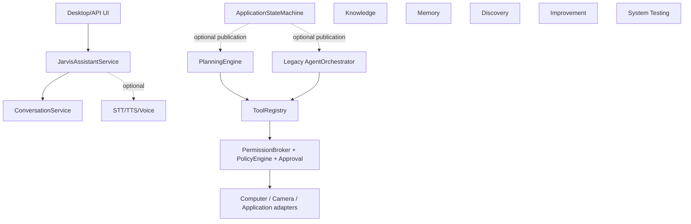

# JARVIS v1 integration baseline audit

**Audit date:** 2026-08-16  
**Baseline branch:** `agent/v1-integration` (local only)  
**Baseline revision:** `b8de381a5dc4e008e58825501752b5a539e7f72a`  
**Worktree:** clean before this document was created. No merge, tag, release, push, or PR publication was performed.

This is an evidence-based inventory of the repository as it exists at the baseline commit. “Complete” means the requested library/test surface is present; “production-wired” means it is constructed and reachable from the application composition root. Those are intentionally separate claims.

## Topology and evidence

The newest cumulative local implementation is the Phase 18 branch tip above. The repository has stacked draft PRs (Phase 5 through Phase 18, with several branches based on earlier phase branches); merging them one by one would not be a safe integration strategy. There is no local or remote Phase 19 branch, commit, or implementation. `agent/v1-integration` was created from the cumulative Phase 18 tip and has not been pushed.

Package metadata reports version `0.1.0` in `pyproject.toml`. Runtime dependencies are FastAPI/httpx/Pydantic/Uvicorn; desktop, Windows, camera, and speech providers are optional extras. The CI workflow runs `scripts/quality.py` and the deterministic workflow suite. Generated project knowledge is in `knowledge/generated/project-index.json`; it contains source file hashes and generation time, but the checked-in artifact has a null/unknown Git revision and is therefore not a trustworthy revision pin by itself.

## Phase matrix

| Phase | Evidence at baseline | Real vs fake/interface | Runtime wiring / validation | Classification |
|---|---|---|---|---|
| 0 foundation | Core config, API, health, conversation and tests | Real library code; local provider boundary | Bootstrap creates chat service; no end-to-end privileged runtime | COMPLETE |
| 1 AI/conversation | `jarvis/ai`, `conversation`, Ollama adapter | Ollama is a real adapter; tests use fakes | Bootstrap-wired when Ollama is configured | COMPLETE |
| 2 autonomy | `jarvis/autonomy` task/orchestrator stack | Real orchestration code, fake tools/providers in tests | Optional injection only; not bootstrap default | PARTIAL / NOT PRODUCTION-WIRED |
| 3 tool boundary | Tool contracts and invocation model | Interfaces plus deterministic tools | Registry exists, but privileged catalog is not composed by bootstrap | SUPERSEDED by Phase 4 (code retained) |
| 4 tool registry | `ToolRegistry`, catalogs, broker binding | Real registry; fake tools dominate tests | Safe registry can be made, not application-composed | COMPLETE library / NOT PRODUCTION-WIRED |
| 5 permissions | granular `Permission`, `PolicyEngine`, `PermissionBroker`, approval/audit | Real security library; policy tests are deterministic | Tools can be broker-bound; no single production composition proof | COMPLETE library / PARTIAL runtime |
| 6 Windows computer | semantic computer tools, filesystem, terminal, UI automation seams | Adapters/interfaces exist; Windows adapters are optional/manual; CI uses mocks | Not composed by bootstrap; Windows integration is skipped | PARTIAL / NOT PRODUCTION-WIRED |
| 7 visual desktop | observation/fusion/grounding/verification workflow and fixtures | `VisionProvider` is abstract; tests use static/fake providers | No concrete production vision provider or bootstrap wiring | PARTIAL / NOT PRODUCTION-WIRED |
| 8 camera | brokered camera tools, lifecycle, OpenCV provider | OpenCV adapter exists but optional/manual; tests mock hardware | Not composed; no real hardware evidence in CI | PARTIAL / NOT PRODUCTION-WIRED |
| 9 applications | inventory/manager/package/catalog/runtime modules | Windows Registry/Winget/runtime are real adapter code but manual/optional; fake providers in tests | Not composed; no autonomous installation | PARTIAL / NOT PRODUCTION-WIRED |
| 10 discovery | capability gaps, provider abstractions, candidate evaluation/provenance | Advisory library; controlled research/provider seams | No automatic install/execute; not runtime-composed | COMPLETE advisory scope / NOT PRODUCTION-WIRED |
| 11 improvement | proposal-only engine, isolated workspace abstraction, gates/evaluator/dependency checks | Deterministic fakes; no production coding sandbox or merge/deploy executor | Proposal ends awaiting trusted approval; not an autonomous deployment path | COMPLETE propose-and-test scope / NOT PRODUCTION-WIRED |
| 12 project knowledge | indexer/store, provenance and secret filtering, generated JSON | Real local indexer; generated artifact is checked in | Refresh script exists; no canonical runtime retrieval composition | COMPLETE indexer / PARTIAL integration |
| 13 system testing | controlled runner, artifacts, diagnosis, regressions, smoke definitions, workflows | Real controlled subprocess abstraction; deterministic workflows use fakes; hardware tagged separately | CI runs deterministic workflow suite; startup/hardware are not full production validation | COMPLETE deterministic scope / PARTIAL hardware |
| 14 memory | distinct conversation/long-term/episodic/system services, SQLite migrations | Real local durable store; tests use temporary SQLite | Not created by bootstrap; no recovery/retention scheduler composition | COMPLETE library / NOT PRODUCTION-WIRED |
| 15 planning | DAG plan schema, validation, budgets, retries, persistence, verification | Real `PlanningEngine`; fake advisor/executor providers in tests | Not the default application task path; legacy orchestrator remains | COMPLETE library / NOT PRODUCTION-WIRED |
| 16 multi-agent | bounded coordinator/contracts, feature flag, comparison workflow | Real bounded scheduler; deterministic fake agents | Disabled by default and not bootstrap-composed | PARTIAL / NOT PRODUCTION-WIRED |
| 17 voice | local controller, wake/VAD/STT/TTS seams, cancellation/state publication | Wake/VAD/audio are abstract; no production wake-word/audio source adapter | Not composed by bootstrap; no real microphone validation | PARTIAL / NOT PRODUCTION-WIRED |
| 18 state | authoritative application/task enums, transition tables, persistence, concurrency rules | Real state machine and stores; optional publishers in planner/orchestrator/voice | Bootstrap creates a machine, but does not make it the single runtime control plane | PARTIAL |
| 19 | No branch, commit, module, or documentation identified | None | No implementation to validate | MISSING |

## Current architecture

The composition root (`jarvis/bootstrap.py`) currently constructs the AI provider, conversation service, optional STT, TTS, and a fresh `ApplicationStateMachine`. It does not construct a durable state store, `PlanningEngine`, `ToolRegistry`/`PermissionBroker` policy graph, memory, knowledge, computer, camera, application manager, discovery, improvement engine, or voice controller. `JarvisAssistantService` accepts a legacy `AgentOrchestrator` only as an optional injected argument. Consequently, most Phase 5–18 capabilities are tested libraries rather than reachable default runtime capabilities.

## Duplicated systems and persistence gaps

- `AgentOrchestrator` and `PlanningEngine` both own task planning/execution. Their status models differ (`TaskStatus` versus `PlanningTaskStatus`).
- Phase 18 adds `TaskState` and `ApplicationState`, while plan/step/voice/autonomy statuses remain separate. Optional publication does not remove those models.
- Legacy autonomy uses an in-memory task store. Planning and state each have SQLite stores, but they are separate and not transactionally linked.
- Memory has its own SQLite database and services, but bootstrap does not create it. Knowledge is a generated JSON artifact, not a runtime source of truth.
- No startup recovery coordinator was found to reconcile active plans/tasks after restart. No general event bus or production scheduler/workflow service was found; `jarvis/testing/workflows.py` is a deterministic test harness.

## Adapter and validation reality

Real provider code exists for Ollama, local TTS, optional Faster-Whisper STT, subprocess execution, OpenCV camera capture, Windows registry/Winget discovery, and Windows UI automation. Optional Windows/camera/speech implementations are marked outside normal coverage and have no CI hardware proof. Vision and wake/VAD/audio providers are abstraction seams without a production implementation. Deterministic tests overwhelmingly use fake providers, fake tools, fake package/application inventories, fake cameras, static screenshots, and fake agents.

The frontend package is only an integration boundary; the application service is the exercised UI-facing path. It does not expose a composed planner/capability runtime. The `jarvis/security` package is currently only a boundary marker (`__init__.py`), while substantive permission/security enforcement lives in `jarvis/permissions` and improvement safety modules.

## Security and production-composition gaps

1. There is no single composition-root assertion that every production privileged adapter is registered through `PermissionBroker` and a concrete policy.
2. The default bootstrap path is chat-oriented and can bypass the intended canonical planning/state path simply because those services are not constructed.
3. The worktree/improvement design is proposal-only, but an in-process coding/test adapter is not an OS sandbox; this remains a documented trust assumption.
4. Real desktop, camera, application-install, and microphone paths need manual permission, cancellation, cleanup, and hardware validation.
5. State publication is optional, so unrelated components can still report independent status models.
6. Generated knowledge can become stale; source hashes exist, but the checked-in index has no reliable revision pin and refresh is not part of the runtime startup contract.

## Recommended canonical runtime

Use one explicit composition root that creates a durable `ApplicationStateMachine`, one `PlanningEngine` backed by a known SQLite store, and one `ToolRegistry` bound to a single `PermissionBroker`/`PolicyEngine`. Route text and voice task creation through the planning engine; keep UI read-only with respect to state. Adapt or deprecate the legacy orchestrator rather than running two task engines. Add startup recovery that marks persisted work as recovering and requires fresh evidence. Compose memory and project knowledge as separate services, and register computer/camera/application tools only when their real adapters and policies are explicitly enabled. Keep discovery and improvement advisory/proposal-only, and keep multi-agent disabled unless a measured workflow benefit justifies enabling it.

## Exact blockers before v1 implementation continues

1. Decide and document the canonical task engine and migration path from `AgentOrchestrator` to `PlanningEngine`.
2. Complete and test the production composition root (broker, registry, policy, planner, state store, recovery).
3. Choose a persistence/recovery strategy that relates plan, task, state, memory, and audit records without conflating their concepts.
4. Supply or explicitly defer production wake-word/VAD/audio, vision, Windows UI, camera, and application adapters; perform separate manual hardware validation.
5. Define the security package’s role and add composition/invariant checks for privileged registrations.
6. Decide frontend/state/event integration and remove or quarantine ad-hoc status publication.
7. Specify Phase 19 requirements; it is absent from this repository and cannot be audited as implemented.
8. Replace the stacked draft-PR topology with one reviewed integration change later; this audit intentionally did not merge or publish anything.

## Suggested next-run scope

Likely files/modules are `jarvis/bootstrap.py`, `jarvis/application.py`, `jarvis/planning/engine.py`, `jarvis/autonomy/orchestrator.py`, `jarvis/state/{machine,store}.py`, `jarvis/tools/{registry,catalog}.py`, `jarvis/permissions/{broker,policy}.py`, `jarvis/frontend`, `jarvis/voice/activation.py`, `jarvis/memory/services.py`, `jarvis/security`, and the relevant architecture/ADR documents. The next run should implement only the selected canonical composition and migration, not speculative rewrites of every adapter.

## Quality-gate evidence

Executed without changing configuration or thresholds on the baseline branch:

- `python scripts/quality.py`: Ruff format check passed (152 files); Ruff lint passed; strict mypy passed for 144 source files; **327 passed, 3 skipped**; coverage **90%** (threshold 90%).
- `python scripts/run_system_tests.py --suite deterministic-workflows`: **26 workflow checks passed**, exit code 0. The emitted run reported Windows (`win32`), Python 3.13.14, and no failure evidence.
- Skips are hardware/optional-platform or privilege-dependent tests (including the Windows integration marker and a symlink-privilege case); no real microphone, camera, desktop UI, or application-install validation was claimed.

The only file changed for this audit is this document. No user work was discarded, and no merge, tag, release, push, or deployment was performed.
